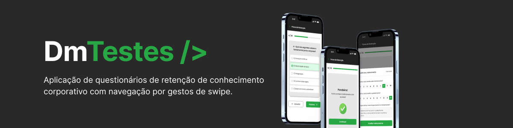
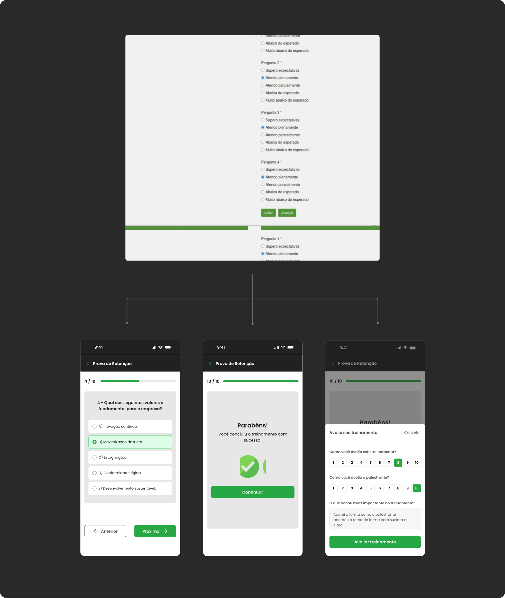

**App para provas de retenção coporativa desenvolvido com animações nativas do Flutter e arquitetura MVVM**

App Flutter para aplicação de questionários de retenção de conhecimento corporativo, com navegação por **gestos de swipe**, construído inteiramente com os recursos nativos de animação do Flutter — sem bibliotecas externas de animação.

O contexto do App é o de atribuir uma tarefa inteiramente do sistema web para o smartphones, o que não existia até a desenvolvimento da tarefa. O App foi desenvolvido usando a **arquitetura MVVM (Model-View-ViewModel)**, separando a View (widgets e interface), ViewModel (lógica de navegação e estado do quiz) e Model (dados das questões).

---

### 1. Rode esse projeto

Siga estes passos para iniciar o projeto localmente:

**a) Clone o repositório**

```bash
git clone git@github.com:RodrigoBerino/dmtestes.git
```

**b) Comandos**

```bash
cd dmtestes

flutter pub get

flutter run
```

---

### 2. Problemática do projeto

O App nasceu da necessidade de tornar as provas de retenção corporativa do sistema **DmTestes** acessíveis para smartphones, com o objetivo de aumentar o engajamento e tornar o fluxo intuitivo, saindo do modelo tradicional de formulários estáticos.

- As telas foram construídas inicialmente no figma, idealizando o projeto e estudando possibilidades de como implementar os questionários digitais em uma tarefa interativa
- A ideia central é navegar entre questões com **swipe horizontal**, como os apps de cards populares
- O usuário pode avançar ou voltar entre questões tanto pelo gesto quanto pelos botões
- Cada troca de card é acompanhada de animações de saída (easeIn), entrada (easeOut) e retorno elástico (elasticOut) quando o swipe não atinge o threshold
- O progresso é exibido visualmente com uma barra animada que atualiza a cada troca de questão

Tarefa de remodelagem e arquiterura de informação do formulário web para smartphones:

<p align="center">
  
</p>

---

### 3. Animações nativas do Flutter

Todas as animações foram implementadas com as APIs nativas do Flutter — `AnimationController`, `AnimatedBuilder`, `Tween`, `CurvedAnimation` e `AnimatedContainer` — sem nenhuma dependência externa de animação.

---

### 4. Tecnologias

- Flutter
- Dart
- Figma
- Material Design 3
- Google Fonts (Inter)
- Arquitetura MVVM
- Animações nativas (AnimationController, Tween, CurvedAnimation)
- Gerenciamento de estado com ChangeNotifier (sem pacotes externos)
